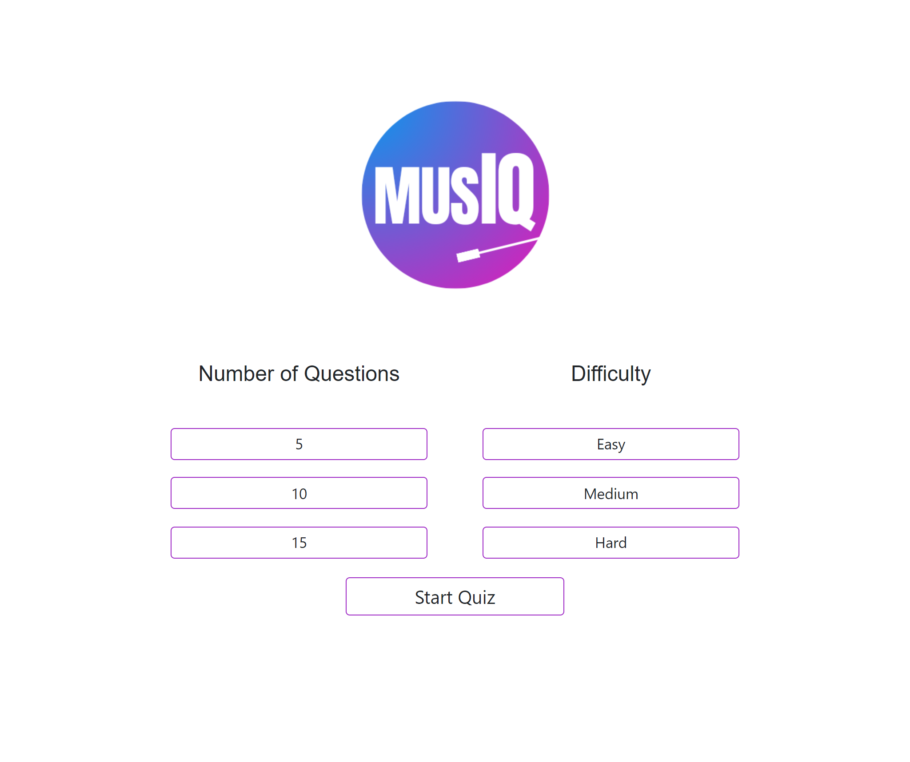
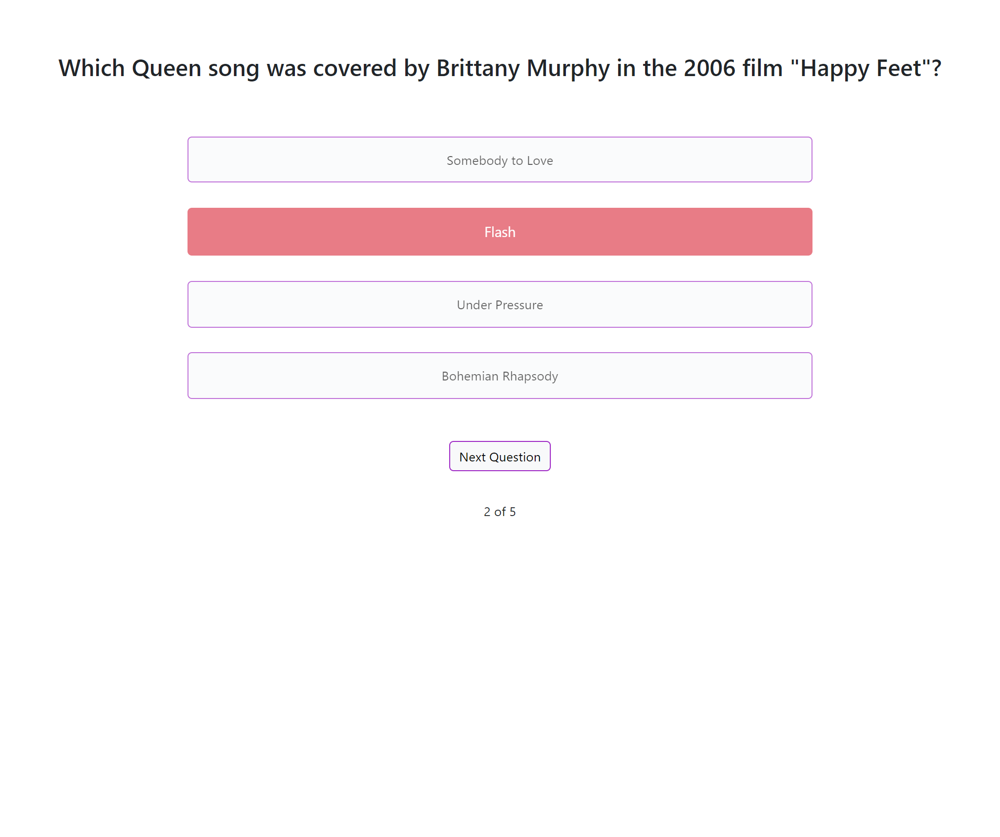
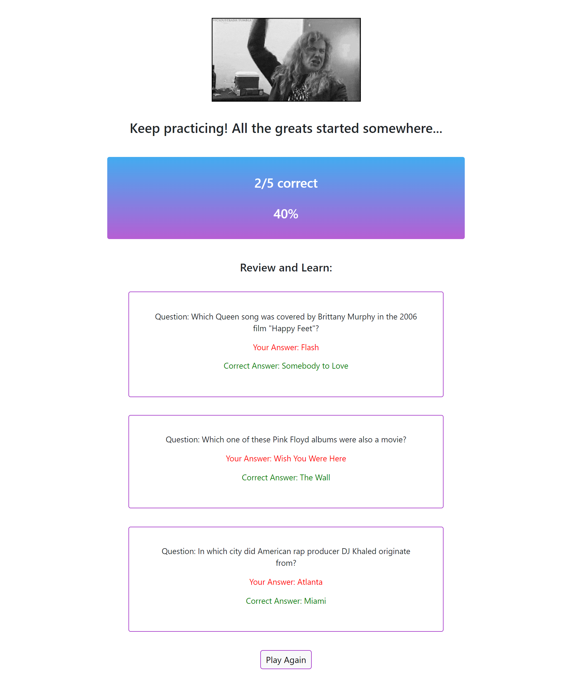
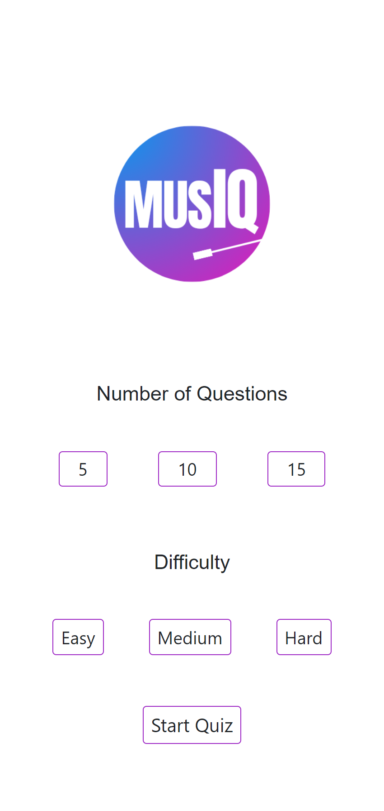
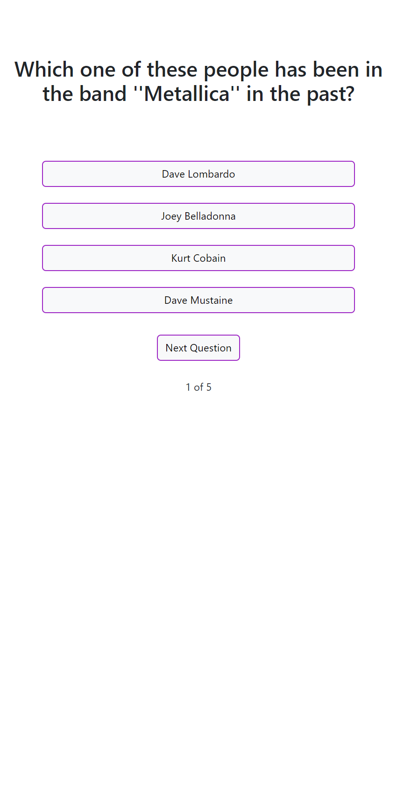
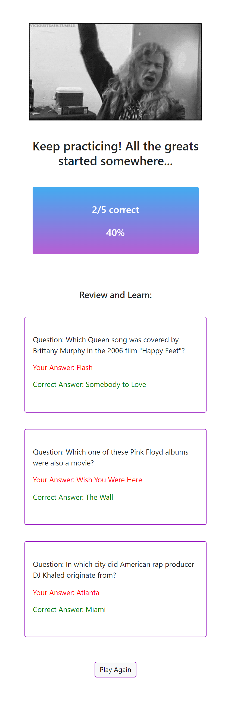

# MusIQ
​[Click to view deployed application](https://grazulisedgars.github.io/Go_Where/)

## Table of Contents

- [Desktop View (Screenshots)](#desktop-screenshots)
- [Mobile View (Screenshots)](#mobile-screenshots)
- [User Story](#user-story)
- [Acceptance Criteria](#acceptance-criteria)
- [Built With](#built-with)
- [How to Use](#how-to-use)
- [Code Overview](#code-overview)
- [Acknowledgments](#acknowledgments)
- [License](#license)

## Desktop Screenshots

## Mobile Screenshots

 ### User Story
 **As a** music lover,
​ 
 **I want** to test my knowledge with a quiz,
​ 
 **So that** I can see how much I know and continue to learn more.

 ### Acceptance Criteria
This project will be considered successful when:
​
- A user can select a number of questions and difficulty.
- Questions are displayed to the user based on their preference.
- The user can select an answer and immediately see if it is correct.
- The user can view their score and the correct answers to the missed questions at the end.
​
### Built With
- HTML
- CSS
- JavaScript
- jQuery
- OTDB API
- Bootstrap
- Giphy API
​
### How to use
1. Choose how many questions to answer in the quiz and the difficulty rating for the round.

2. Click to Start Quiz.
3. Choose your answer to each question and your choice will turn green if correct or red if incorrect.
4. Click Next Question. To view how many questions remain, see below the Next Question button.
5. Repeat until the final question, then click Submit to view your results on the Stats page.
6. Review the questions answered incorrectly and see the correct answer displayed below your choice.
7. Click Play Again to start again from the Welcome page and repeat from Step 1.
​
### Code Overview
The site is predominantly built using REACT and JSX. The site consists of three pages, the first screen is the main selection screen, the second screen displays the trivia questions, and the third screen shows the user's quiz results.
​
#### JavaScript
##### destinations.js
This file contains the data for the destinations that are displayed to the user.
​
##### script.js
Contains the logic for transitioning between the two screens which constitute the site - the initial call to action and the display of our video selecton.
​
#### HTML
##### index.html 
Contains the HTML for the main selection screen and the second screen which displays the videos to the user.
​
#### CSS
##### style.css
Contains the styling for the site which overrides some of the default styling provided by Bootstrap.
​
​
### Acknowledgments
- [Edgars Grazulis](https://github.com/grazulisedgars)
- [Cari Fillingham](https://github.com/cariberrii)
- [Aiden Graham](https://github.com/AG466)

- [Open Trivia DB API](https://opentdb.com/api_config.php)
- [Giphy API](https://developers.giphy.com/docs/api/)
- [Bootstrap](https://getbootstrap.com/)
- [jQuery](https://jquery.com/)
- [Netlify](https://docs.netlify.com/)

## License

MIT License

Copyright (c) 2023 grazulisedgars

Permission is hereby granted, free of charge, to any person obtaining a copy
of this software and associated documentation files (the "Software"), to deal
in the Software without restriction, including without limitation the rights
to use, copy, modify, merge, publish, distribute, sublicense, and/or sell
copies of the Software, and to permit persons to whom the Software is
furnished to do so, subject to the following conditions:

The above copyright notice and this permission notice shall be included in all
copies or substantial portions of the Software.

THE SOFTWARE IS PROVIDED "AS IS", WITHOUT WARRANTY OF ANY KIND, EXPRESS OR
IMPLIED, INCLUDING BUT NOT LIMITED TO THE WARRANTIES OF MERCHANTABILITY,
FITNESS FOR A PARTICULAR PURPOSE AND NONINFRINGEMENT. IN NO EVENT SHALL THE
AUTHORS OR COPYRIGHT HOLDERS BE LIABLE FOR ANY CLAIM, DAMAGES OR OTHER
LIABILITY, WHETHER IN AN ACTION OF CONTRACT, TORT OR OTHERWISE, ARISING FROM,
OUT OF OR IN CONNECTION WITH THE SOFTWARE OR THE USE OR OTHER DEALINGS IN THE
SOFTWARE.
